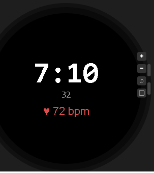
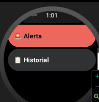
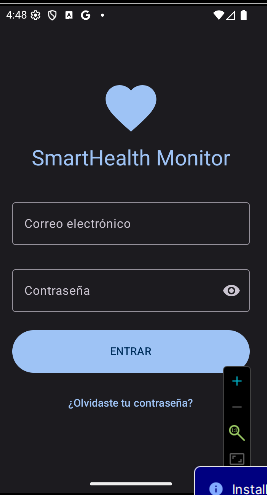
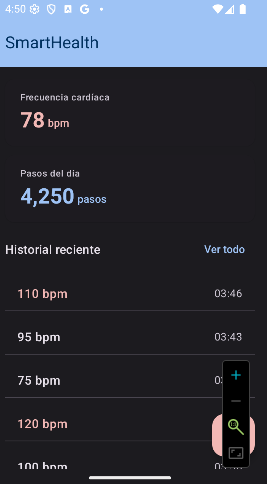
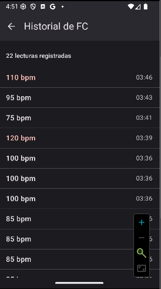
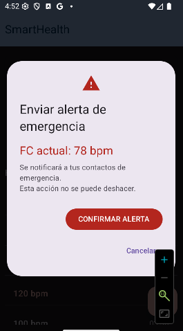

# SmartHealth Monitor

Aplicación Android de monitoreo de salud personal en tiempo real. Desarrollada como proyecto integrador — UTNG 9° Cuatrimestre.

## Stack tecnológico

| Tecnología | Uso |
| :--- | :--- |
| **Kotlin + Jetpack Compose** | UI declarativa con Material Design 3 |
| **Wearable Data Layer API** | Comunicación reloj ↔ teléfono (BLE) |
| **Health Services API** | Sensor FC real en background (Wear OS) |
| **Room Database** | Historial persistente de lecturas FC |
| **Jetpack Navigation** | NavHost entre las pantallas de la aplicación |
| **GitHub + Conventional Commits** | Control de versiones profesional |

## Pantallas

| Pantalla | Descripción |
| :--- | :--- |
| **LoginScreen** | Autenticación con validación de campos y estados de carga |
| **DashboardScreen** | Visualización de FC y Pasos en tiempo real provenientes del wearable con botón de pánico |
| **HistorialScreen** | Listado de lecturas persistidas en Room DB mediante el uso de Flow reactivo |
| **AlertaScreen** | Diálogo emergente (AlertDialog MD3) con spinner de carga y Snackbar de confirmación |
## Unidad II — Wear OS
| Pantalla | Descripción |
|---|---|
| WearDashboardScreen | FC en tiempo real con ScalingLazyColumn y TimeText |
| WearHistorialScreen | Lista con Rotary Input (corona del reloj) |
| WearAlertaScreen | Botones circulares de confirmación |
| SmartHealth WatchFace | Hora + FC en el WatchFace nativo |

### WatchFace

### WearDashboard

Paso 2 — PR y Tag v1.2.0
11.En GitHub: Compare & pull request → título: feat: Wear OS advanced — Rotary Input + WatchFace — S10 Unidad II.
12.Merge pull request → Confirm merge.
Checklist de autoevaluación — Unidad II completa

## Capturas de pantalla

Región de evidencias visuales del comportamiento de la aplicación en el emulador:

### Login

### Dashboard

### Historial

### Alerta de Emergencia

## Autor

Ana María Barrientos Guerrero — UTNG — Ing. en Desarrollo y Gestión de Software (GIDS6093)

